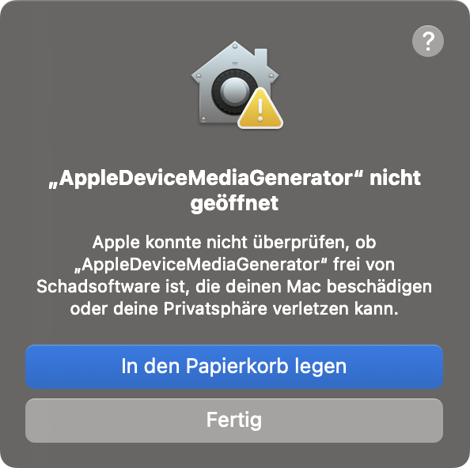
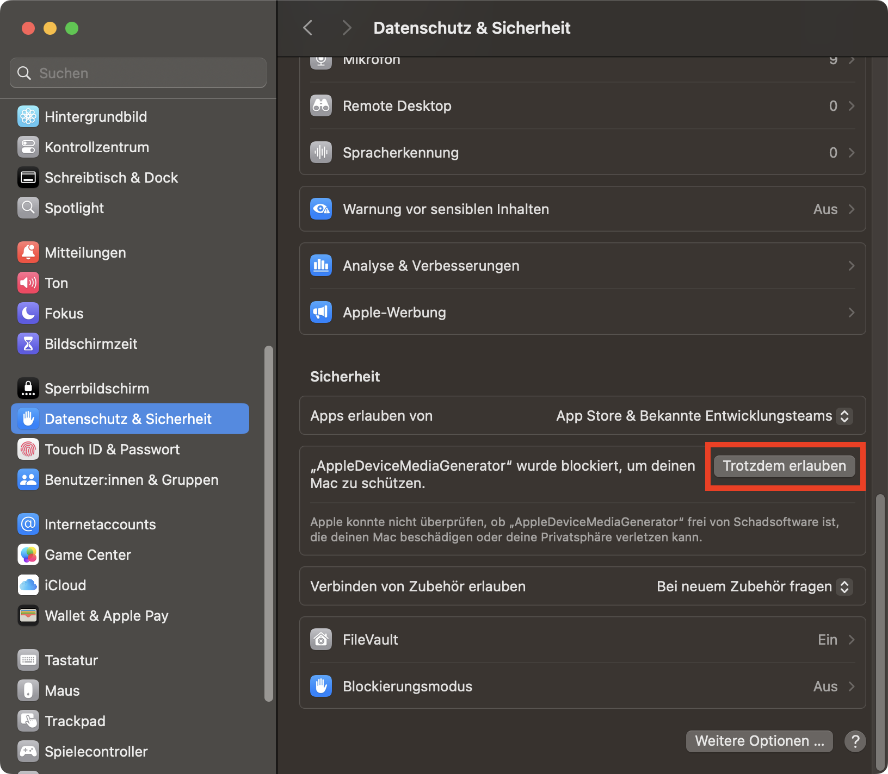

# AppleDeviceMediaGenerator

AppleDeviceMediaGenerator is a command line tool designed to generate media assets for presentations. It converts videos such as screen recordings into presentable versions including the border of the selected apple device and includes a transparent background.

### Using Binary from Releases

1. Download the latest binary from the [Releases](https://github.com/moritz-reclaire/AppleDeviceMediaGenerator/releases) page.
2. Extract the downloaded file.
3. Open your terminal and navigate to the directory containing the binary.
4. Make executable
    ```
    chmod +x AppleDeviceMediaGenerator
    ```
5. Run:
    ```
    ./AppleDeviceMediaGenerator [OPTIONS] INPUT_PATH OUTPUT_PATH
    ```

### Building from Source

1. Clone the repository:
    ```
    git clone https://github.com/your-repo/AppleDeviceMediaGenerator.git
    ```
2. Navigate to the project directory:
    ```
    cd AppleDeviceMediaGenerator
    ```
3. Build the project:
    ```
    pyinstaller AppleDeviceMediaGenerator.spec
    ```
4. Run the tool:
    ```
    dist/AppleDeviceMediaGenerator [OPTIONS] INPUT_PATH OUTPUT_PATH
    ```

## How to Use
Refer to the help page: `AppleDeviceMediaGenerator --help`
```
Usage: AppleDeviceMediaGenerator [OPTIONS] INPUT_PATH OUTPUT_PATH

  INPUT_PATH is the path to the raw file e.g. a screen recording.

  OUTPUT_PATH is the path to the produced file.

Options:
  --island / --no-island          Adds a dynamic island. Use this if the
                                  screen recording does not include the notch
                                  / dynamic island. Default: --no-island.
  --device [iPhone-16-Pro|iPad-11-Pro|macbook-pro-14]
                                  Device used for the frame and aspect ratio.
                                  Default: iPhone-16-Pro.  [required]
  --help                          Show this message and exit.
```

## Tips
- Make sure the video you are using roughly matches the aspect-ratio of the target device. Otherwise large areas are cropped to fill the screen while keeping the aspect-ratio.
- When using a prebuilt binary you may have to grant access in system settings
<div style="display: flex; justify-content: center; gap: 1rem;">
    
    
</div>